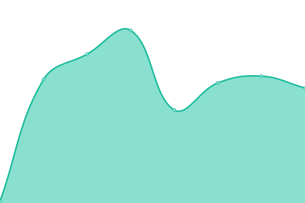
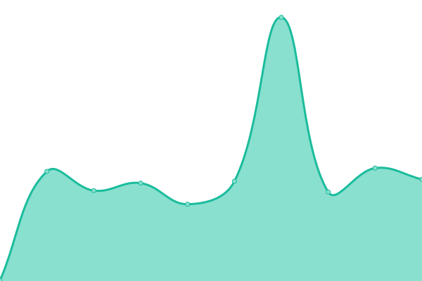
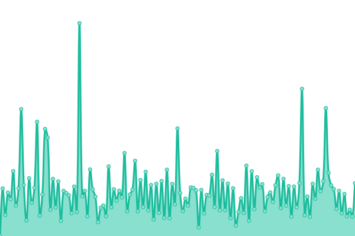
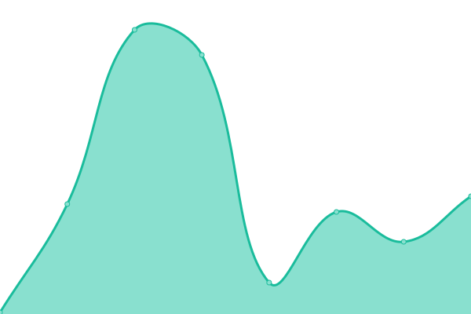
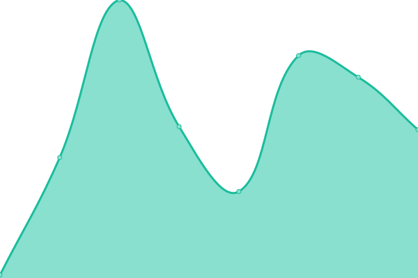

# [📈 Live Status](https://demo.upptime.js.org): <!--live status--> **🟧 Partial outage**

This repository contains the open-source uptime monitor and status page for [Francisco Marín](https://savenergyspa.com/), powered by [Upptime](https://github.com/upptime/upptime).

With [Upptime](https://upptime.js.org), you can get your own unlimited and free uptime monitor and status page, powered entirely by a GitHub repository. We use [Issues](https://github.com/PanchoSavEnergy/MonitoreoPaginasWeb/issues) as incident reports, [Actions](https://github.com/PanchoSavEnergy/MonitoreoPaginasWeb/actions) as uptime monitors, and [Pages](https://demo.upptime.js.org) for the status page.

<!--start: status pages-->
<!-- This summary is generated by Upptime (https://github.com/upptime/upptime) -->
<!-- Do not edit this manually, your changes will be overwritten -->
<!-- prettier-ignore -->
| URL | Status | History | Response Time | Uptime |
| --- | ------ | ------- | ------------- | ------ |
|  [Google](https://www.google.com) | 🟩 Up | [google.yml](https://github.com/PanchoSavEnergy/MonitoreoPaginasWeb/commits/HEAD/history/google.yml) | 

 78ms
     
 | 

<a href="https://PanchoSavEnergy.github.io/MonitoreoPaginasWeb/history/google">100.00%</a>
    

|  [SavEnergy SpA](https://www.savenergyspa.com/) | 🟩 Up | [sav-energy-sp-a.yml](https://github.com/PanchoSavEnergy/MonitoreoPaginasWeb/commits/HEAD/history/sav-energy-sp-a.yml) | 

 330ms
     
 | 

<a href="https://PanchoSavEnergy.github.io/MonitoreoPaginasWeb/history/sav-energy-sp-a">100.00%</a>
    

|  [SavEnergy Instagram](https://www.instagram.com/savenergy.spa/) | 🟩 Up | [sav-energy-instagram.yml](https://github.com/PanchoSavEnergy/MonitoreoPaginasWeb/commits/HEAD/history/sav-energy-instagram.yml) | 

 358ms
     
 | 

<a href="https://PanchoSavEnergy.github.io/MonitoreoPaginasWeb/history/sav-energy-instagram">7.50%</a>
    

|  [Test Broken Site](https://thissitedoesnotexist.koj.co) | 🟥 Down | [test-broken-site.yml](https://github.com/PanchoSavEnergy/MonitoreoPaginasWeb/commits/HEAD/history/test-broken-site.yml) | 

 0ms
     
 | 

<a href="https://PanchoSavEnergy.github.io/MonitoreoPaginasWeb/history/test-broken-site">100.00%</a>
    

|  [API Rest Favoritos Url](https://shorturl-session.herokuapp.com/auth/login) | 🟥 Down | [api-rest-favoritos-url.yml](https://github.com/PanchoSavEnergy/MonitoreoPaginasWeb/commits/HEAD/history/api-rest-favoritos-url.yml) | 

 120ms
     
 | 

<a href="https://PanchoSavEnergy.github.io/MonitoreoPaginasWeb/history/api-rest-favoritos-url">0.00%</a>
    

|  [Angular Shop](https://panchosavenergy.github.io/angular2-shop/) | 🟩 Up | [angular-shop.yml](https://github.com/PanchoSavEnergy/MonitoreoPaginasWeb/commits/HEAD/history/angular-shop.yml) | 

 68ms
     
 | 

<a href="https://PanchoSavEnergy.github.io/MonitoreoPaginasWeb/history/angular-shop">100.00%</a>
    

<!--end: status pages-->

[**Visit my status website →**](https://panchosavenergy.github.io/MonitoreoPaginasWeb/)

[**Visit the original status website →**](https://demo.upptime.js.org)

## 📄 License

- Powered by: [Upptime](https://github.com/upptime/upptime)
- Code: [MIT](./LICENSE) © [Francisco Marín](https://savenergyspa.com/)
- Data in the `./history` directory: [Open Database License](https://opendatacommons.org/licenses/odbl/1-0/)
